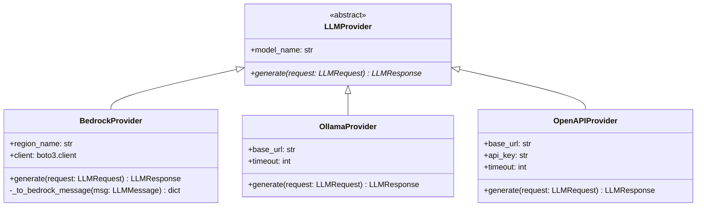
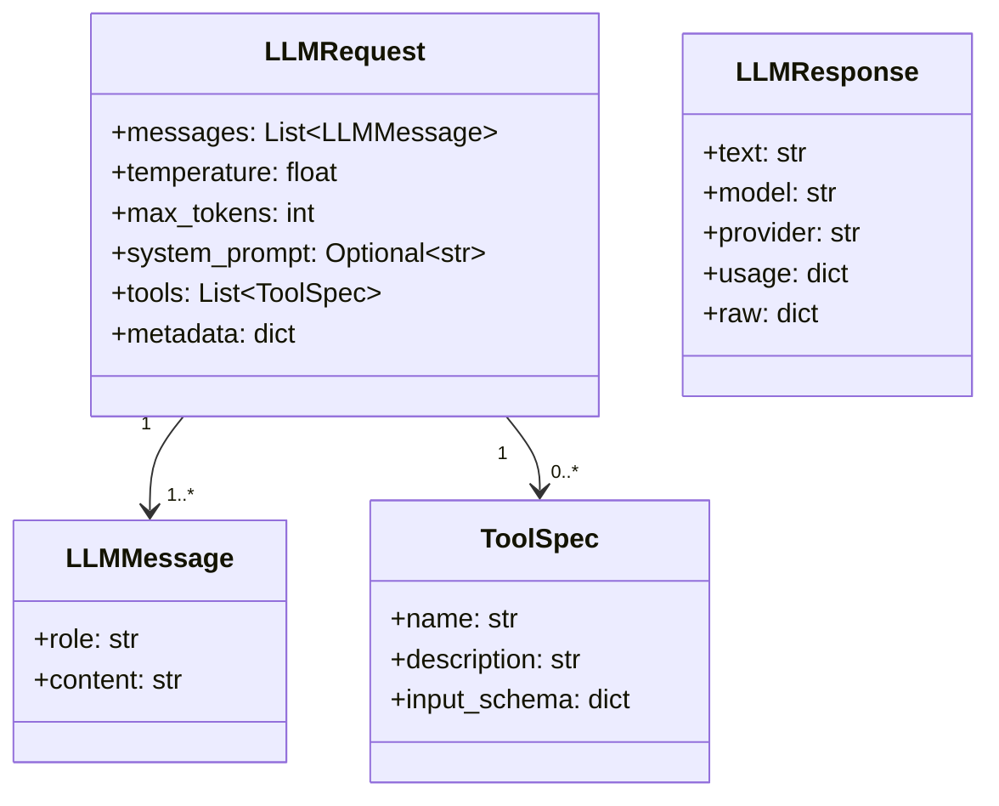
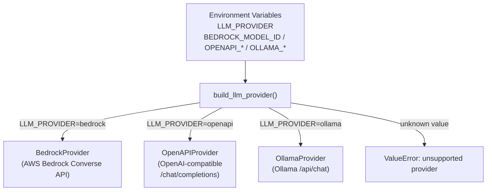
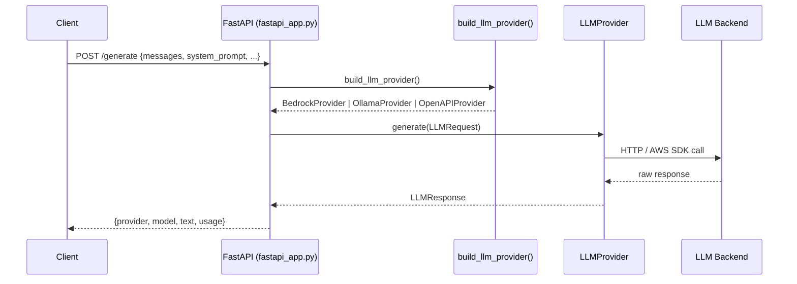
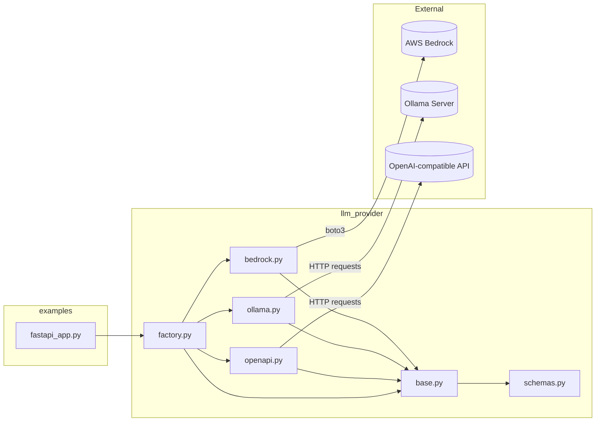

# Architecture

## Overview

This workspace provides a unified **LLM Provider** abstraction layer that normalises calls to multiple LLM back-ends behind a single interface, and exposes that interface through a **FastAPI** HTTP service.

---

## Package Structure

```
workspace/
├── llm_provider/          # Core library
│   ├── __init__.py        # Public API surface
│   ├── base.py            # Abstract base class
│   ├── schemas.py         # Shared dataclasses
│   ├── factory.py         # Provider factory (env-driven)
│   ├── bedrock.py         # AWS Bedrock implementation
│   ├── ollama.py          # Ollama implementation
│   └── openapi.py         # OpenAI-compatible implementation
└── examples/
    └── fastapi_app.py     # REST API example
```

---

## Class Hierarchy



---

## Data / Schema Model



---

## Provider Factory Flow



---

## FastAPI Request Lifecycle



---

## External Dependencies



---

## Environment Variables Reference

| Variable | Used by | Purpose |
|---|---|---|
| `LLM_PROVIDER` | `factory.py` | Selects the active provider (`bedrock`, `openapi`, `ollama`) |
| `BEDROCK_MODEL_ID` | `BedrockProvider` | Model ID on AWS Bedrock |
| `AWS_REGION` | `BedrockProvider` | AWS region (default `us-east-1`) |
| `OPENAPI_BASE_URL` | `OpenAPIProvider` | Base URL of the OpenAI-compatible endpoint |
| `OPENAPI_API_KEY` / `OPENAI_API_KEY` | `OpenAPIProvider` | API key |
| `OPENAPI_MODEL` | `OpenAPIProvider` | Model name |
| `OLLAMA_BASE_URL` | `OllamaProvider` | Ollama server URL (default `http://localhost:11434`) |
| `OLLAMA_MODEL` | `OllamaProvider` | Model name served by Ollama |
