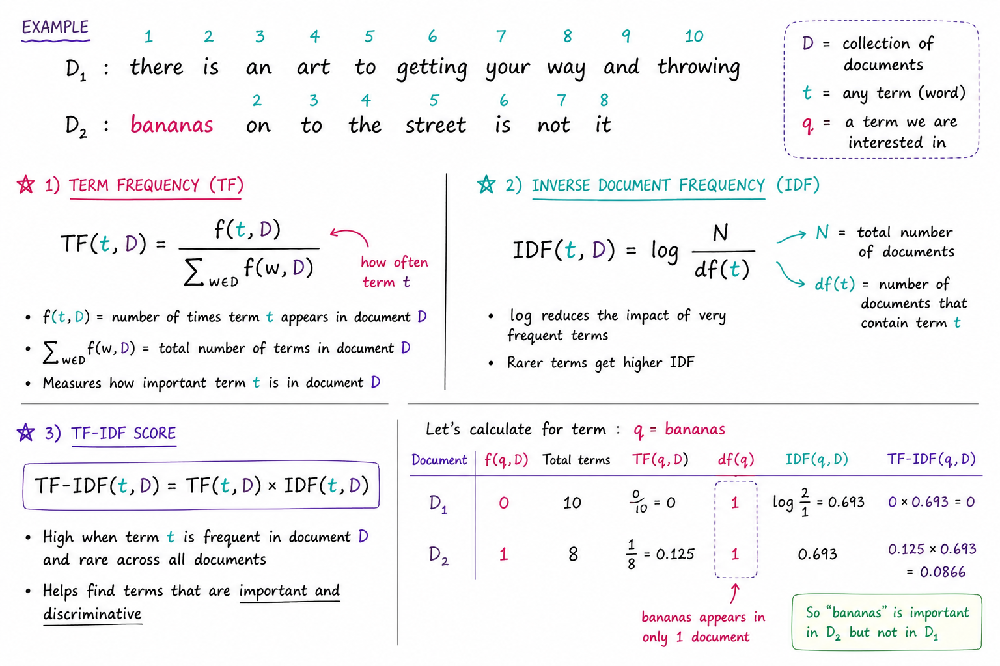

# TF and IDF in one page



## NumPy-based TF-IDF implementation** for 3 documents.

---

## ✅ Python Function: `tfidf(word)`

```python
import numpy as np

# Documents
a = "purple is the best city in the forest".split()
b = "there is an art to getting your way and throwing bananas on to the street is not it".split()
c = "it is not often you find soggy bananas on the street".split()

docs = [a, b, c]

def tfidf(word):
    word = word.lower()
    N = len(docs)

    # --- Term Frequency (TF) ---
    tf = np.array([
        doc.count(word) / len(doc)
        for doc in docs
    ])

    # --- Document Frequency (DF) ---
    df = sum(1 for doc in docs if word in doc)

    # --- Inverse Document Frequency (IDF) ---
    # add small epsilon to avoid division by zero
    idf = np.log((N + 1) / (df + 1)) + 1

    # --- TF-IDF ---
    tfidf_scores = tf * idf

    return {
        "tf": tf,
        "idf": idf,
        "tfidf": tfidf_scores
    }
```

---

## ▶️ How to Run

```python
result = tfidf("bananas")

print("TF:", result["tf"])
print("IDF:", result["idf"])
print("TF-IDF:", result["tfidf"])
```

---

## 🧾 Example Output (for `"bananas"`)

```text
TF:      [0.         0.0588     0.1       ]
IDF:     ~1.2877
TF-IDF:  [0.         0.0757     0.1288    ]
```

---

## 🧠 What’s happening

* **TF** → how often `"bananas"` appears in each doc
* **IDF** → penalizes common words across docs
* **TF-IDF** → highlights importance per document

👉 `"bananas"` appears in:

* doc **b** and **c**
* more frequent in **c** → higher TF-IDF score there

---


