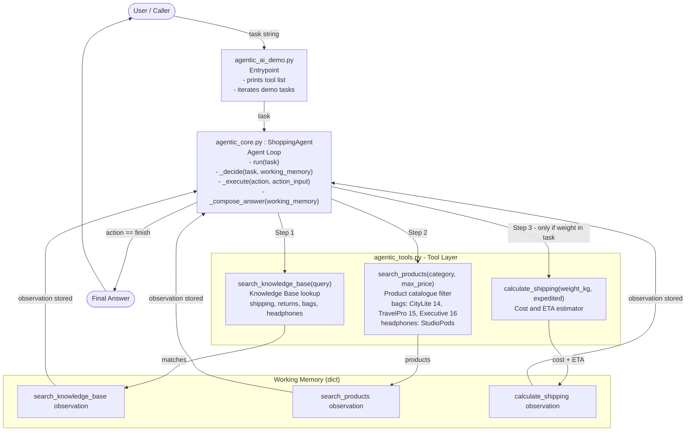

# Agentic AI Demo — Architecture

## Overview

This section of the workspace shows how a minimal **agentic AI application** works:
a goal-driven loop that selects tools, calls them, accumulates observations in
working memory, and synthesises a final answer.

---

## Architecture Diagram



---

## File Map

| File | Role |
|---|---|
| `agentic_ai_demo.py` | Entrypoint — runs two demo tasks and prints step-by-step traces |
| `agentic_core.py` | Agent loop — `ShoppingAgent` with `_decide -> _execute -> working memory` cycle |
| `agentic_tools.py` | Tool layer — `search_knowledge_base`, `search_products`, `calculate_shipping` |

---

## Agent Loop — Step by Step

```
+------------------------------------------------------+
|                    Agent Loop                        |
|                                                      |
|  1. Receive task (natural-language goal string)      |
|                                                      |
|  +-----------------------------------------------+  |
|  |  THINK  _decide(task, working_memory)          |  |
|  |   - Inspect what has already been observed    |  |
|  |   - Choose the next tool OR "finish"          |  |
|  +-------------------+--------------------------+  |
|                      |                             |
|  +-------------------v--------------------------+  |
|  |  ACT    _execute(action, action_input)        |  |
|  |   - Call the selected tool function          |  |
|  |   - Returns a structured observation dict   |  |
|  +-------------------+--------------------------+  |
|                      |                             |
|  +-------------------v--------------------------+  |
|  |  OBSERVE  working_memory[action] = result    |  |
|  |   - Store the observation for future steps  |  |
|  +-------------------+--------------------------+  |
|                      |                             |
|        loop back to THINK until action == "finish" |
|                      |                             |
|  +-------------------v--------------------------+  |
|  |  ANSWER  _compose_answer(working_memory)     |  |
|  |   - Synthesise final response from all obs  |  |
|  +----------------------------------------------+  |
+------------------------------------------------------+
```

---

## Running the Demo

```bash
python3 agentic_ai_demo.py
```

No API key or external model is required — the planner uses a rule-based
policy so every step is fully deterministic and inspectable.
